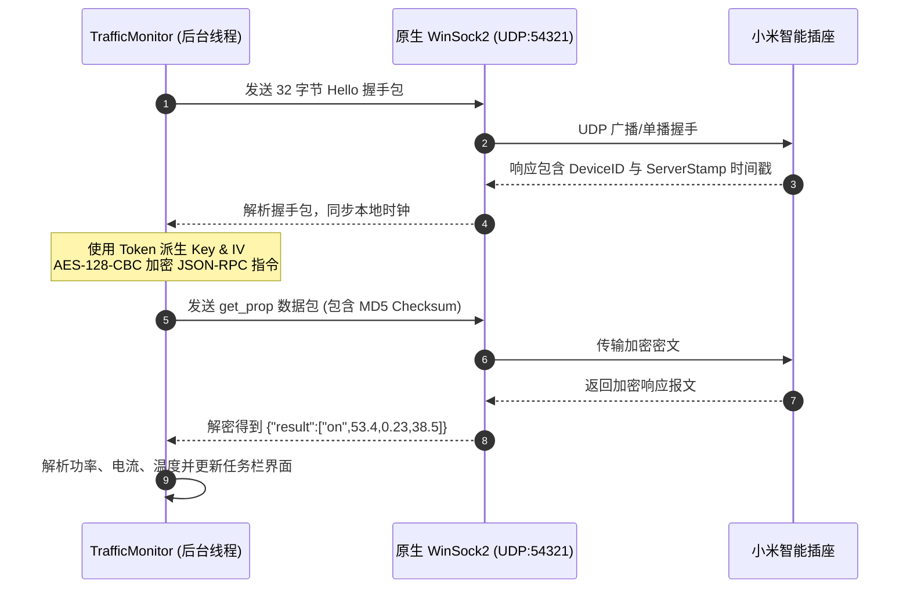

# MiPlugin-Traff (v1.1.2)

> ⚡ **TrafficMonitor 小米智能插座/插线板电力监控插件**  
> 专为 Windows 任务栏系统监控神器 [TrafficMonitor](https://github.com/zhongyang219/TrafficMonitor) 定制开发的高性能原生 C++ 单文件 DLL 插件。基于局域网 miIO 加密协议，实现实时功率、工作电流、内部温度及开关状态的毫秒级异步监控。
> 为什么要开发？ 因为官方的推荐插件似乎失效了我试了好几次都不行所以就有这个这个小插件。
> 对于有家庭服务器和小米插座的用户，在自己的笔记本电脑上可以实施看到服务器功耗（或者其他设备功耗），能够即使调整节约很多电能。

[](LICENSE)
[](https://microsoft.com)
[]()
[]()
[-purple.svg)]()

---

## 🖥️ 基础界面与交互体验

插件与 Windows 任务栏及 TrafficMonitor 无缝深度集成，提供以下三层核心界面与交互：

### 1. 任务栏实时监控栏 (Taskbar Item)
直接嵌入在 Windows 任务栏监控区域，支持 3 个独立监控项自由勾选与排列：
* **实时功率**：`P: 53.4 W`（支持 `W` / `kW` / `纯数字`，支持 0~2 位小数自由切换）。
* **工作电流**：`I: 0.23 A`（精确展示插座实时通过电流）。
* **内部温度**：`T: 38.5 ℃`（实时掌握插座主控及传感器温度）。
* **离线状态**：网络中断或未连接时自动显示 `--`。
* **过载告警**：当功率超过设定警戒阈值时，自动在前缀显示感叹号警示（如 `! 2200.0 W`）。

### 2. 精致悬停信息卡片 (Tooltip Card)
当鼠标悬停在任务栏图标或功率数值上时，自动弹出原生毛玻璃样式卡片，汇总展示完整状态：

```text
┌──────────────────────────────────────────────┐
│ 【主机插座】                                 │
│ 开关状态: 🟢 开启 (ON)                       │
│ 实时功率: 53.40 W                            │
│ 工作电流: 0.23 A                             │
│ 内部温度: 38.5 ℃                             │
│ ⚠️ 告警: 当前功率已超过设定阈值 (1000.0 W)！   │
│ 更新时间: 23:20:15                           │
└──────────────────────────────────────────────┘
```

### 3. Win32 原生设置面板 (Options Dialog)
右键监控项点击**【选项】**即可打开纯原生设置窗口，支持以下精细配置：

| 配置模块 | 选项项目 | 控件类型 | 功能与说明 |
| :--- | :--- | :--- | :--- |
| **设备标识** | 设备名称 | 单行文本框 | 自定义插座备注（如 `书房主机`、`鱼缸排插`） |
| **网络通信** | 设备 IP 地址 | 文本框 + 按钮 | 插座局域网 IPv4 地址；内置**【测试连接】**按钮 |
| **安全鉴权** | 设备 Token | 单行文本框 | 32 位十六进制设备密钥（AES-128 加解密必需） |
| **采样频率** | 刷新间隔 (秒) | 数字文本框 | 建议设置 **10 秒以上**（避免频繁请求导致设备拥塞） |
| **显示风格** | 功率显示单位 | 下拉选择框 | 可选：`瓦特 (W)` / `千瓦 (kW)` / `纯数字` |
| **显示风格** | 保留小数位数 | 下拉选择框 | 可选：`0 位 (整数)` / `1 位` / `2 位` |
| **安全告警** | 告警功率阈值 | 浮点文本框 | 功率超限警戒值（单位 W，设为 0 表示不启用告警） |

---

## 🌟 核心特性

- 🔌 **实时多维指标监控**：同时支持功率、电流、内部温度三大核心物理参数。
- 🎈 **精致悬停卡片 (Tooltip)**：信息一目了然，无需打开手机 App 即可洞悉设备详情。
- 🛡️ **高功耗报警高亮**：支持过载功率阈值高亮提示，保障用电安全。
- 🚀 **异步非阻塞引擎 (Zero UI Lag)**：
  - 数据采集运行在独立后台工作线程，主界面 UI **0 毫秒卡顿**。
  - 支持双击一键异步控制插座电源开关，彻底杜绝因网络延迟导致的系统任务栏假死。
- 📦 **零外部依赖 (Pure Win32)**：
  - 纯原生 C++17 开发，基于 Windows 系统底层 `BCrypt` 与 `WinSock2`。
  - 纯静态多线程 CRT (`/MT`) 编译，无需安装 Python 或额外 VC++ 运行库。
- ⚙️ **即时热更新与持久化**：配置保存后立即唤醒后台刷新，参数自动写入 `XiaomiPlugPlugin.ini`。

---

## 🔑 关键前置步骤：米家设备 Token 获取指南

米家智能设备在局域网内通信必须通过 **32 位十六进制 Token** 进行 AES-128-CBC 加密鉴权。

> [!IMPORTANT]
> **推荐使用开源工具**：**[Xiaomi-cloud-tokens-extractor](https://github.com/PiotrMachowski/Xiaomi-cloud-tokens-extractor/releases)**  
> 访问地址：[`https://github.com/PiotrMachowski/Xiaomi-cloud-tokens-extractor/releases`](https://github.com/PiotrMachowski/Xiaomi-cloud-tokens-extractor/releases)

### 提取步骤：
1. 前往 [Xiaomi-cloud-tokens-extractor Releases](https://github.com/PiotrMachowski/Xiaomi-cloud-tokens-extractor/releases) 下载最新的 `token_extractor.exe`。
2. 双击运行该程序，按命令行提示输入：
   - **Username**：小米账号（手机号/邮箱/小米 ID）
   - **Password**：小米账号密码
   - **Server**：服务器区域（国内设备直接输入 `cn` 并回车）
3. 登录成功后，程序将列出您账号绑定的所有米家设备列表。
4. 找到您的智能插座/插线板，记录并复制以下两项关键信息：
   - **IP 地址**（如 `192.168.1.105`）
   - **Token 字符串**（32 位十六进制字符，如 `4a6f7b8c9d0e1f2a3b4c5d6e7f8a9b0c`）

---

## 🚀 简要操作手册与使用流程


### 1. 放置插件文件
1. 进入本项目的 `release/` 目录（或下载发布的 Release 压缩包）。
2. 根据您的 TrafficMonitor 运行架构选择对应的 DLL：
   - **64 位 TrafficMonitor**：使用 `release/x64/XiaomiPlugPlugin.dll`（绝大多数现代 Windows 10/11 系统推荐）。
   - **32 位 TrafficMonitor**：使用 `release/x86/XiaomiPlugPlugin.dll`。
3. 将 `XiaomiPlugPlugin.dll` 复制到 TrafficMonitor 安装目录下的 **`plugins/`** 文件夹中（例如 `D:\TrafficMonitor\plugins\`）。

### 2. 在 TrafficMonitor 中启用
1. 启动或重启 TrafficMonitor。
2. 右键任务栏主窗口 -> **【插件管理】** -> 找到并勾选 **【MiPlugin-Traff】**。
3. 右键任务栏主窗口 -> **【显示设置】** -> **【项目显示】** -> 勾选 **【小米插座实时功率】**（按需可同时勾选电流与温度项）。

### 3. 配置参数与连通性测试
1. 在任务栏上的功率监控数值上**右键** -> 选择 **【选项】**（或在插件管理界面中点击“选项”）。
2. 填写配置项：
   - **设备名称**：自定义备注（如 `主机插座`、`鱼缸插排`）。
   - **设备 IP 地址**：输入插座在局域网中的 IPv4 地址。
   - **设备 Token**：粘贴前面获取的 32 位 Token 字符串。
   - **刷新间隔**：建议 **`10 秒以上`**（推荐 10~30 秒，既保证数据及时性，又兼顾设备主控负载）。
   - **显示单位与精度**：支持 W / kW / 纯数字，支持 0~2 位小数。
   - **告警阈值**：设置功率上限（例如 `1000` W），设为 `0` 则禁用。
3. 点击 **【测试连接】** 按钮：
   - 弹窗提示“测试连接成功”并展示当前插座开关状态与实时功率，即表示配置无误。
4. 点击 **【确定】** 保存，插件立即开始工作并持久化配置文件 `XiaomiPlugPlugin.ini`。

---

## ⚠️ 避坑指南与常见问题 (Troubleshooting)

```mermaid
flowchart TD
    Start[监控项显示 '--' 离线或连接失败] --> Q1{点击【测试连接】的报错提示?}
    
    Q1 -->|无法与插座握手| A1[检查: 1. 电脑与插座是否在同一局域网 / Wi-Fi\n2. 路由器是否开启了 AP 隔离 / 访客网络\n3. 插座 IP 地址是否已发生变动]
    Q1 -->|握手成功但发送指令超时| A2[检查: Token 是否填写错误或过期\n设备重置后 Token 会变更，需重新提取]
    Q1 -->|DLL 无法加载或列表中没有插件| A3[检查: TrafficMonitor 主程序架构与 DLL 是否匹配\n(64位 TrafficMonitor 必须使用 x64 目录下的 DLL)]

    A1 --> Fix1[路由器中为插座绑定静态 DHCP 租约]
    A2 --> Fix2[使用 Xiaomi-cloud-tokens-extractor 重新提取]
    A3 --> Fix3[换用正确的 x64/x86 版本 DLL]
```

### 🔴 避坑 1：TrafficMonitor 找不到插件或无法加载
* **原因**：TrafficMonitor 区分 32 位 (x86) 和 64 位 (x64) 版本。32 位主程序无法加载 64 位 DLL，反之亦然。
* **解决**：在 TrafficMonitor 的“关于”窗口确认主程序位数，将 `release/x64/` 或 `release/x86/` 下对应的 `XiaomiPlugPlugin.dll` 放入 `plugins/` 目录。

### 🔴 避坑 2：运行一段时间后突然显示 `--`（离线）
* **原因**：智能插座默认使用 DHCP 动态获取 IP。当路由器重启或租期到期后，插座 IP 地址可能发生改变。
* **解决**：登录路由器管理后台（通常为 `192.168.1.1` 或 `192.168.31.1`），在 **【静态 IP 绑定】/【DHCP 静态租约】** 中，将插座的 MAC 地址绑定为固定 IP。

### 🔴 避坑 3：重新配网或重置插座后无法通信
* **原因**：只要小米插座重新连接了 Wi-Fi 或被重置，其芯片内部生成的 **Token 会被强制更新**。旧 Token 将彻底失效。
* **解决**：重新使用 [Xiaomi-cloud-tokens-extractor](https://github.com/PiotrMachowski/Xiaomi-cloud-tokens-extractor/releases) 工具提取最新的 Token，并更新到插件配置窗口中。

### 🔴 避坑 4：测试连接提示“无法与插座握手”
* **原因 1（AP 隔离）**：路由器开启了“AP 隔离”或插座连接在“访客 Wi-Fi”上，导致局域网设备间无法互访。
* **原因 2（防火墙拦截）**：miIO 协议基于 **UDP 54321 端口**。如果电脑开启了严格的第三方防火墙或跨了不同 VLAN 网段，UDP 包会被丢弃。
* **解决**：关闭路由器 AP 隔离，确保插座与电脑处于同一局域网网段，检查安全软件未阻止 UDP 54321 端口。

### 🔴 避坑 5：测试连接提示“握手成功但发送指令超时”
* **诊断分析**：握手成功说明网络通道是通畅的，UDP 54321 可以正常收发；但指令解密或校验失败导致插座丢弃了请求。
* **解决**：100% 为 **Token 填写错误**（如误带空格、字母大小写混淆或复制了其他设备的 Token）。请仔细核对 32 位 Token 字符串。

### 🔴 避坑 6：刷新频率设置过高导致插座响应迟钝
* **原因**：部分老款小米智能插座主控芯片算力有限，过于频繁的 miIO 加解密查询（如每秒多次）可能导致插座通信协议栈拥塞或掉线。
* **建议**：将刷新间隔保持在 **`10 秒以上`**（推荐 10~30 秒），既保证实时性又兼顾设备硬件的长期稳定性。

---

## 🔌 兼容设备与通信协议原理

### 支持设备型号
本插件基于 miIO `get_prop` 协议实现，兼容绝大部分支持电量统计的米家插座与插排，包括但不限于：
- **小米智能插座 基础版 / 增强版 / 2 代 / 3 代** (`chuangmi.plug.v1`, `chuangmi.plug.v3`, `chuangmi.plug.m3`, `chuangmi.plug.212a01` 等)
- **小米米家智能插座 WiFi 版** (`chuangmi.plug.m1`, `chuangmi.plug.hmi206`)
- **米家智能插线板 / 青米插线板** (`qmi.powerstrip.v1`, `zimi.powerstrip.v2`)

### 通信原理


---

## 📂 项目工程架构

```text
Mi-Plugin/
├── include/                  # 核心头文件
│   ├── PluginInterface.h     # TrafficMonitor 官方 SDK 接口契约
│   ├── XiaomiPlugPlugin.h    # 插件主控制器与数据项声明
│   ├── MiioClient.h          # 原生 miIO 协议栈实现声明
│   ├── ConfigManager.h       # INI 配置文件读写管理器
│   ├── CryptoHelper.h        # Windows BCrypt AES-128-CBC / MD5 加密辅助类
│   └── OptionsDlg.h          # Win32 原生设置对话框声明
├── src/                      # 源码实现
│   ├── XiaomiPlugPlugin.cpp  # 插件生命周期管理与数据格式化
│   ├── MiioClient.cpp        # 握手、时间戳同步、指令加解密通信
│   ├── ConfigManager.cpp     # INI 持久化实现
│   └── OptionsDlg.cpp        # 对话框控件逻辑与异步测试连通性
├── res/                      # Windows 资源文件
│   └── Version.rc            # DLL 版本信息定义
├── tools/                    # Python 独立调试与探测工具
│   ├── miio_device.py        # 原生 miIO 通信库
│   ├── probe_plug.py         # 局域网快速握手探测脚本
│   ├── get_plug_power.py     # 单次功率查询 CLI 工具
│   └── monitor_power.py      # 持续实时功率监控 CLI 工具
├── release/                  # 预编译分发包
│   ├── x64/XiaomiPlugPlugin.dll  # 64 位正式发布版
│   ├── x86/XiaomiPlugPlugin.dll  # 32 位正式发布版
│   └── README.md             # 分发包简要说明
├── build.bat                 # 一键 MSVC 自动化编译脚本
├── build_release.ps1         # 生产级发布版 PowerShell 自动化构建脚本
├── CMakeLists.txt            # 标准 CMake 构建系统
├── LICENSE                   # Apache 2.0 开源许可证
└── README.md                 # 项目主文档
```

---

## 🛠️ 源码编译与构建

### 开发环境要求
* **操作系统**：Windows 10 / 11
* **编译工具**：Visual Studio 2019 / 2022 / 2026（需安装“使用 C++ 的桌面开发”组件）或 MSVC Build Tools
* **构建系统**：CMake 3.15+ 或 直接使用项目内脚本

### 方法 1：一键批处理构建 (推荐)
直接双击运行根目录下的 `build.bat` 或在 PowerShell 中执行：
```powershell
.\build_release.ps1
```
脚本将自动调用 `vswhere` 定位 MSVC 编译器，启用全程序优化（`/GL` + `/O2` + `/LTCG` + `/OPT:REF`）并生成 `x64` 和 `x86` 双架构动态链接库到 `release/` 目录。

### 方法 2：标准 CMake 构建
```bash
mkdir build
cd build
cmake .. -DCMAKE_BUILD_TYPE=Release
cmake --build . --config Release
```

---

## 📄 版权与许可

本项目采用 **[Apache License, Version 2.0](LICENSE)** 许可证开源。  

* **作　　者**：Simon Chen  
* **项目主页**：[`https://github.com/SimonChen-86/MiPlugin-Traff`](https://github.com/SimonChen-86/MiPlugin-Traff)  
* **版权所有**：Copyright &copy; 2026 Sim-OpenSource. All rights reserved.  
* **宿主项目**：感谢 [TrafficMonitor](https://github.com/zhongyang219/TrafficMonitor) 提供的优秀系统监控框架与插件体系。
